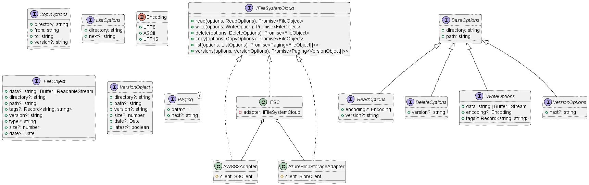

# Class Diagram

<!--
@startuml
/'!theme sketchy-outline '/
skinparam handwritten true
interface IFileSystemCloud {
 +read(options: ReadOptions): Promise<FileObject>
 +write(options: WriteOption): Promise<FileObject>
 +delete(options: DeleteOptions): Promise<FileObject>
 +copy(options: CopyOptions): Promise<FileObject>
 +list(options: ListOptions): Promise<Paging<FileObject[]>>
 +versions(options: VersionOptions): Promise<Paging<VersionObject[]>>
}

interface BaseOptions {
 +directory: string
 +path: string
}

interface ReadOptions extends BaseOptions {
 +encoding?: Encoding
 +version?: string
}

interface DeleteOptions extends BaseOptions {
 +version?: string
}

interface CopyOptions extends BaseOptions {
 +to: string
 +version?: string
}

interface WriteOptions extends BaseOptions {
 +data: string | Buffer | Stream
 +encoding?: Encoding
 +tags?: Record<string, string>
}

interface ListOptions {
 +directory: string
 +next?: string
}

interface VersionOptions extends BaseOptions {
 +next?: string
}

enum Encoding {
 +UTF8
 +ASCII
 +UTF16
}

interface FileObject {
 +data?: string | Buffer | ReadableStream
 +directory?: string
 +path?: string
 +tags?: Record<string, string>
 +version?: string
 +type?: string
 +size?: number
 +date?: Date
}

interface VersionObject {
 +directory?: string 
 +path?: string
 +version?: string
 +size?: number
 +date?: Date
 +latest?: boolean
}

interface Paging<T> {
 +data: T
 +next: string
}

class FSC implements IFileSystemCloud {
 -adapter: IFileSystemCloud
}

class AWSS3Adapter implements IFileSystemCloud {
 #client: S3Client
}

class AzureBlobStorageAdapter implements IFileSystemCloud {
 #client: BlobClient
}

FSC o-- AWSS3Adapter
FSC o-- AzureBlobStorageAdapter
@enduml
-->

This is a class diagram for FSC 